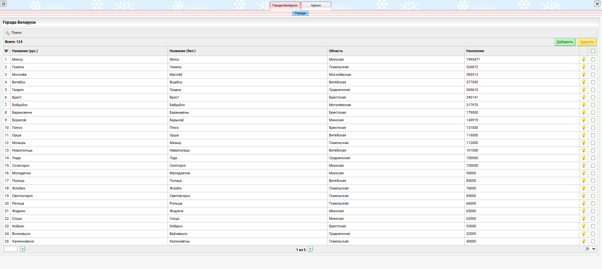

# Модуль «Города Беларуси» (cities)

**Версия:** 1.0.0  
**Фреймворк:** Core2 2.9.x  
**PHP:** >= 8.2  
**БД:** MySQL

---

## Описание

Модуль реализует справочник городов Беларуси. Позволяет просматривать, добавлять, редактировать и удалять записи городов через административную панель Core2.

### Возможности

- Табличный список городов с сортировкой и поиском по названию (рус.)
- Добавление / редактирование / удаление записи
- Поля: русское название, белорусское название, область, район, население, год основания
- Переключатель активности (вкл/выкл)
- Сохранение через XAJAX (без перезагрузки страницы)

### Структура таблицы `mod_belarus_cities`

| Поле | Тип | Описание |
|------|-----|----------|
| `id` | INT | Идентификатор |
| `name_ru` | VARCHAR(255) | Название города (рус.) |
| `name_be` | VARCHAR(255) | Название города (бел.) |
| `region` | VARCHAR(255) | Область |
| `area` | VARCHAR(255) | Район |
| `population` | INT | Население |
| `foundation_year` | VARCHAR(10) | Год основания |
| `is_active_sw` | ENUM('Y','N') | Активность |
| `seq` | INT | Порядок сортировки |

---

## Установка

### 1. Копирование модуля

Скопируйте папку `cities` в директорию `mod/` вашего проекта Core2:

```
project/
├── index.php
├── conf.ini
├── core2/
└── mod/
    └── cities/
        └── v1.0.0/
```

### 2. Импорт таблицы

Выполните SQL из файла `v1.0.0/install/install.sql` или создайте таблицу вручную:

```sql
CREATE TABLE IF NOT EXISTS `mod_belarus_cities` (
  `id` int(10) unsigned NOT NULL AUTO_INCREMENT,
  `name_ru` varchar(255) NOT NULL,
  `name_be` varchar(255) DEFAULT NULL,
  `region` varchar(255) DEFAULT NULL,
  `area` varchar(255) DEFAULT NULL,
  `population` int(10) unsigned DEFAULT NULL,
  `foundation_year` varchar(10) DEFAULT NULL,
  `is_active_sw` enum('Y','N') NOT NULL DEFAULT 'Y',
  `seq` int(10) unsigned NOT NULL DEFAULT 0,
  PRIMARY KEY (`id`)
) ENGINE=InnoDB DEFAULT CHARSET=utf8;
```

### 3. Регистрация модуля

Вставьте запись в таблицу `core_modules`:

| `module_id` | `m_name` | `is_public` | `is_system` | `visible` | `version` |
|-------------|----------|-------------|-------------|-----------|-----------|
| `cities` | Города Беларуси | Y | N | Y | 1.0.0 |

Добавьте субмодуль в `core_submodules`:

| `m_id` | `sm_name` | `sm_key` | `seq` |
|--------|-----------|----------|-------|
| `<m_id cities>` | Города | `index` | 5 |

### 4. Права доступа (ACL)

В `core_acl_default` для роли добавьте:

- `access` — доступ к модулю
- `list_all` — просмотр списка
- `read_all` — чтение записи

---

## Скриншот



*Табличный список городов с поиском и добавлением.*

---

## Разработка

### Файлы модуля

| Файл | Назначение |
|------|------------|
| `ModCitiesController.php` | Контроллер (action_index) |
| `ModAjax.php` | AJAX-обработчики (axSaveCities) |
| `js/cities.js` | JavaScript-функции |
| `conf.ini` | Конфигурация модуля |

### Добавление нового поля

1. Добавьте колонку в таблицу `mod_belarus_cities`
2. Добавьте поле в `$edit->addControl(...)` в `ModCitiesController.php`
3. Добавьте поле в массив `$fields` в `ModAjax.php` (если обязательное)
4. Добавьте колонку в `$list->addColumn(...)` для отображения в таблице

---

## Запуск на другой машине

Требования:
- PHP >= 8.2
- MySQL 5.7+ или PostgreSQL
- Core2 фреймворк (версия 2.9.x)
- Веб-сервер (Apache) или Docker (ddev)

Быстрый старт в Docker (ddev):

config.yaml
```
name: project
type: php
docroot: .
php_version: "8.2"
webserver_type: apache-fpm
xdebug_enabled: false
additional_hostnames: []
additional_fqdns: []
database:
    type: mariadb
    version: "10.11"
performance_mode: none
use_dns_when_possible: true
composer_version: "2"
web_environment: []
corepack_enable: true
default_container_timeout: "240"
webimage_extra_packages:
    - gearman
    - php8.2-gearman
```

```bash
ddev start
ddev composer i
# сайт доступен на https://project.ddev.site
```

